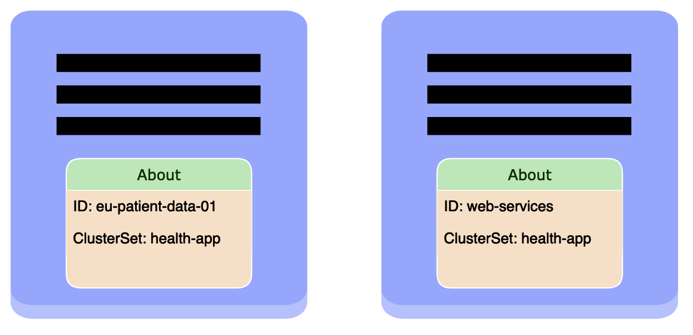

# About API Overview

This document provides an overview of the About API.



The About API allows metadata to be attached to individual clusters.
The fundamental resource defined in the API is the ClusterProperty CRD.

You can read more details about the API in [KEP-2149](https://github.com/kubernetes/enhancements/tree/master/keps/sig-multicluster/2149-clusterid).

## ClusterProperty CRD

The ClusterProperty CRD is proposed to give a Kubernetes-native way of identifying clusters, however, it can be used to store any metadata about a cluster.

### Example

```
apiVersion: about.k8s.io/v1beta1
kind: ClusterProperty
metadata:
  name: cluster.clusterset.k8s.io
spec:
  value: cluster-1
```

In the above example the ClusterProperty CRD is used to identify a cluster with the id of `cluster-1`. The key in this example `cluster.clusterset.k8s.io`, is one of the two proposed well-known properties.

### Well-known properties
There are two well-known properties proposed:

- `cluster.clusterset.k8s.io` A unique ID or name of the cluster. The value is implementation-specific, but it should be unique within the scope of the cluster set.
- `clusterset.k8s.io` The cluster set that the cluster belongs to. A cluster which is part of a cluster set should have this property set.
