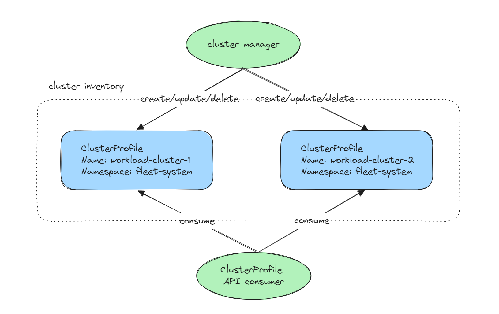

# ClusterProfile API Overview

This document provides an overview of the [ClusterProfile API](https://github.com/kubernetes-sigs/cluster-inventory-api?tab=readme-ov-file#cluster-profile-api).



A Cluster Profile is a namespace-level resource and essentially represents an individual member of the Cluster Inventory
that details properties and status of a cluster. This API proposes a standardized interface that defines how cluster information should be presented
and interacted with across different platforms and implementations.

You can read more details about the API in the [KEP-4322](https://github.com/kubernetes/enhancements/blob/master/keps/sig-multicluster/4322-cluster-inventory/README.md).

## Terminology

- **Cluster Inventory**: A conceptual term referring to a collection of clusters. A cluster inventory may or may not represent
a [ClusterSet](../api-types/cluster-set.md). A cluster inventory is considered a clusterSet if all its member clusters adhere to the 
[namespace sameness](https://github.com/kubernetes/community/blob/master/sig-multicluster/namespace-sameness-position-statement.md) principle.

- **Cluster Manager**: An entity that creates the ClusterProfile API object per member cluster,
  and keeps their status up-to-date. Each cluster manager MUST be identified with a unique name.  
  Each ClusterProfile resource SHOULD be managed by only one cluster manager. A cluster manager SHOULD
  have sufficient permission to access the member cluster to fetch the information so it can update the status
  of the ClusterProfile API resource.

- **ClusterProfile API Consumer**: the person running the cluster managers
  or the person developing extensions for cluster managers for the purpose of
  workload distribution, operation management etc.

## API Example

[CRD definition](https://github.com/kubernetes-sigs/cluster-inventory-api/blob/main/config/crd/bases/multicluster.x-k8s.io_clusterprofiles.yaml)

```yaml
apiVersion: multicluster.x-k8s.io/v1alpha1
kind: ClusterProfile
metadata:
 name: generated-cluster-name
 labels:
   x-k8s.io/cluster-manager: some-cluster-manager
spec:
  displayName: some-cluster
  clusterManager:
    name: some-cluster-manager
status:
 version:
   kubernetes: 1.28.0
 properties:
   - name: clusterset.k8s.io
     value: some-clusterset
   - name: location
     value: apac
 conditions:
   - type: ControlPlaneHealthy
     status: True
     lastTransitionTime: "2023-05-08T07:56:55Z"
     message: ""
   - type: Joined
     status: True
     lastTransitionTime: "2023-05-08T07:58:55Z"
     message: ""
```
