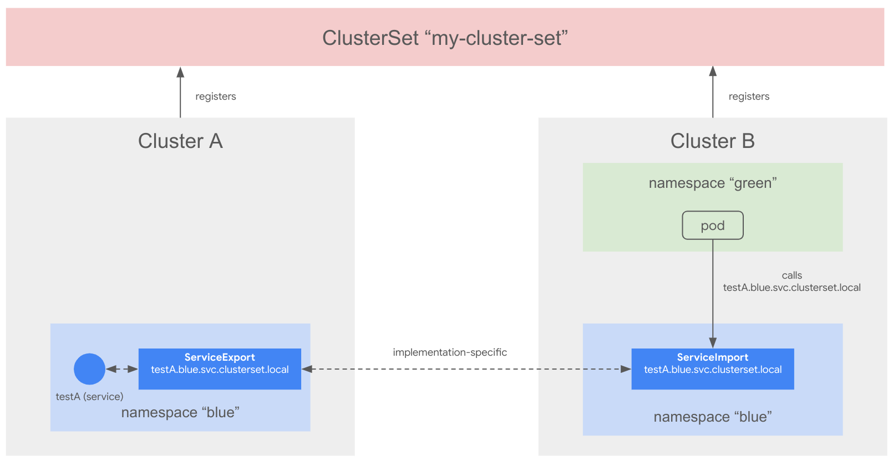

# Multicluster Services API Overview

This document provides an overview of Multicluster Services API.

This is an extension of the Services concept across multiple clusters. Services are the basic way that workloads communicate with each other in Kubernetes, and the Multicluster Services builds upon the [Namespace Sameness](./namespace-sameness.md) concept to extend Services across multiclusters. In short, Services can remain available across clusters simply by using the same names. The Control Plane can be centralized or decentralized, but consumers only even rely on local data.

This document solely focuses on the API and the common behaviour, leaving room for various [implementations](../guides/index.md). There is no reference implementation available.

The intent of the Multicluster Services API is that ClusterIP and headless services just work as expected across clusters.

You can read more details about the API in the [KEP-1645](https://github.com/kubernetes/enhancements/tree/master/keps/sig-multicluster/1645-multi-cluster-services-api).

# Multicluster API concepts

### Service and ServiceExport
* Main interaction point for user/administrator with MCS
* A custom resource you can create that marks a Service for export
* The mcs-controller consumes these
Learn more at [ServiceExport](../api-types/service-export.md)

### ServiceImport and EndpointSlices
* Created by the mcs-controller in all namespace-same clusters in the ClusterSet
* Representing the imported service and all the available backends for it across the ClusterSet
* Used to create the related EndpointSlices in consuming clusters
Learn more at [ServiceImport](../api-types/service-import.md)