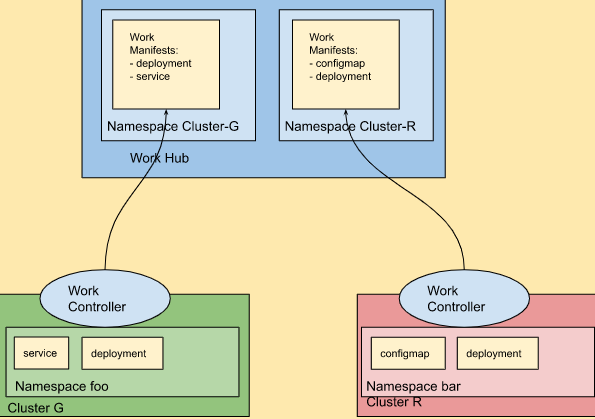

# Work API Overview

A common [Work API](https://github.com/kubernetes-sigs/work-api) to distribute workload to multiple clusters.



## Terminology

- **Work Hub** is a Kubernetes cluster where the Work API resource resides.
- **Managed Cluster** or Spoke Cluster is a Kubernetes cluster managed by the Work Hub. 
The workload resources defined in the Work API are applied on the managed cluster. 
- **Work Controller** is a controller that reconciles the Work API resource on Work Hub, 
and applies resources defined in the Work to the Managed Cluster.


## Overview

A Work is a custom resource that represent a list of API resources to be deployed on a cluster.
The Work is created on the Work Hub, and resides in the namespace that the Work Controller is authorized to access.
Creation of a Work on the Work Hub indicates that resources defined in the Work will be applied on a certain Managed Cluster.
Update of a Work will trigger the resource update on the Managed Cluster, and deletion of a Work will garbage collect the resources on the Managed Cluster.

## Example

```
apiVersion: multicluster.x-k8s.io/v1alpha1
kind: Work
metadata:
 name: work-sample
 namespace: cluster1
spec:
 workload:
   manifests:
   - apiVersion: v1
     kind: ConfigMap
     metadata:
       name: cm
       namespace: default
     data:
       ui.properties: |
         color=purple
```

User creates a Work in the `cluster1 namespace on the Work Hub that the Work Controller is authorized to access. 
The Work Controller then accesses the Managed Cluster and applies the resources defined in the Work in its reconcile loop.
The Work controller also tracks the status of applied resources by updating the Work status.

## Implementation

This Work API project solely focuses on the API and the common behaviour, leaving room for various implementations.
There is a reference implementation available in the [GitHub repo](https://github.com/kubernetes-sigs/work-api).

For more advanced Work API implementations:

- Open Cluster Management [ManifestWork API](https://open-cluster-management.io/concepts/manifestwork/)
- Karmada [Work API](https://github.com/karmada-io/api/tree/main/work/)
- Azure [Work API](https://github.com/Azure/k8s-work-api)
