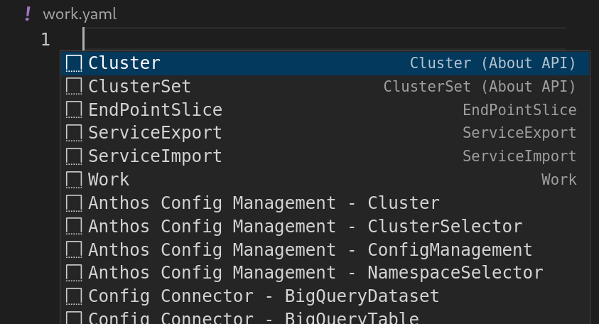
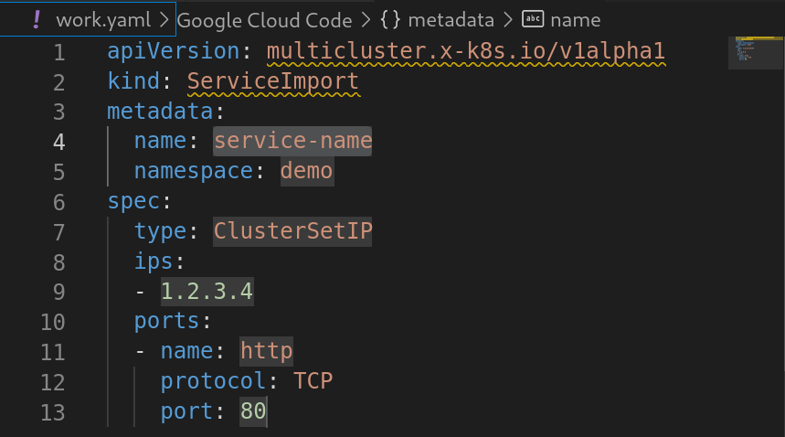

# Snippets for Visual Studio Code
The file [yaml.json](./yaml.json) in this folder can be appended to your Visual Studio Code user configuration YAML edition preferences `(\${HOME}/.config/Code/\${USER}/yaml.json)` to enable a simplified experience when writing MCS-related manifests.
> As the yaml.json contains all personalized snippets, it is recommended to append the contents and not copy over the file.

Once the snippets are copied over, create a new YAML file, and press `CTRL + Space`, and you should see a list of snippets available.

If you select, say for example, the ServiceImport snippet, your file will be pre-filled with the corresponding snippet. Using the tab key, you can navigate easily between the different values that you may want to change.

